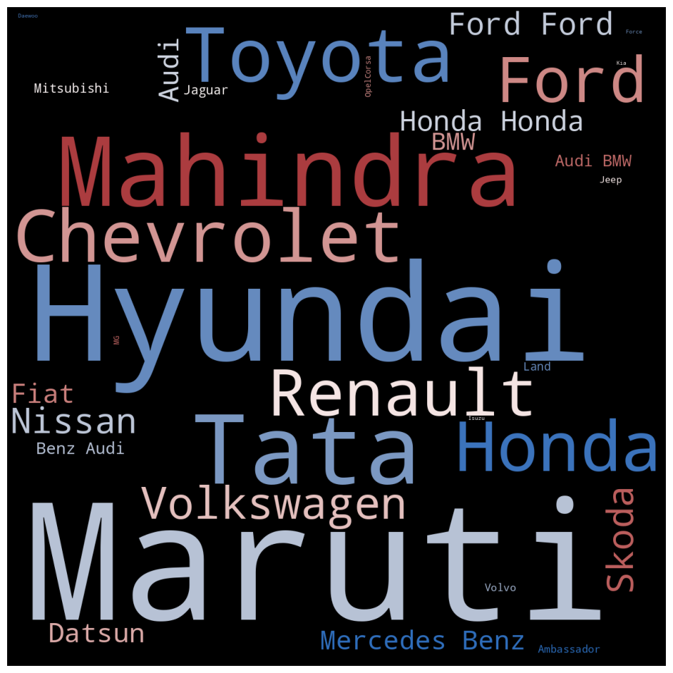
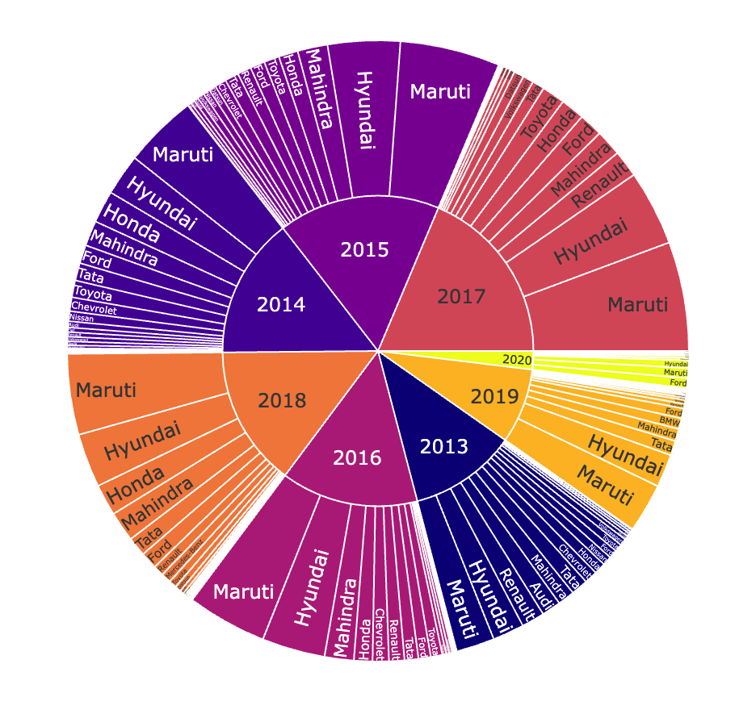
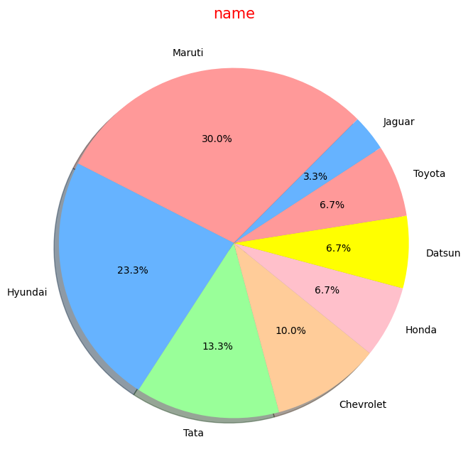
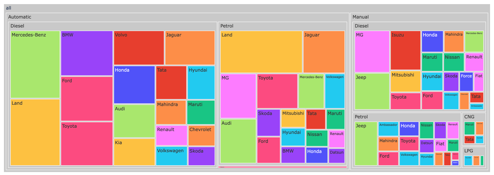

# ⭐️ Car Data Analysis ⭐️

This project analyzes car sales data collected from **Car Dekho**. The dataset includes:  

- Car Name  
- Year  
- Selling Price  
- Kms Driven  
- Fuel Type  
- Seller Type  
- Transmission  
- Owner  

The goal of this project is to explore trends, distributions, and relationships in the car dataset, and provide visual insights using Python libraries like **Pandas, Seaborn, Matplotlib, and Plotly**.

---

## 📂 Dataset

**Number of rows:** 4340  
**Columns:** `name`, `year`, `selling_price`, `km_driven`, `fuel`, `seller_type`, `transmission`, `owner`  

---

## 🔧 Libraries Used
- numpy
- pandas
- seaborn
- matplotlib
- plotly

---

## 📝 Steps Performed

1. **Loading Dataset**
2. **Exploratory Data Analysis**
3. **Feature Engineering**
4. **Data Visualization**
5. **Result Analysis**

---

## 📸 visualization Preview 

## 📊 Key Insights

- **Best-selling Car Brand:** Maruti, followed by Hyundai  
- **Car Type:** Mostly manual transmission  
- **Owner Distribution:** Mostly first-hand cars  
- **Seller Type:** Majority sold individually  
- **Peak Year:** Most cars sold in 2017  

---

You can explore the full analysis in [AutoMetaAnalytics.ipynb]

